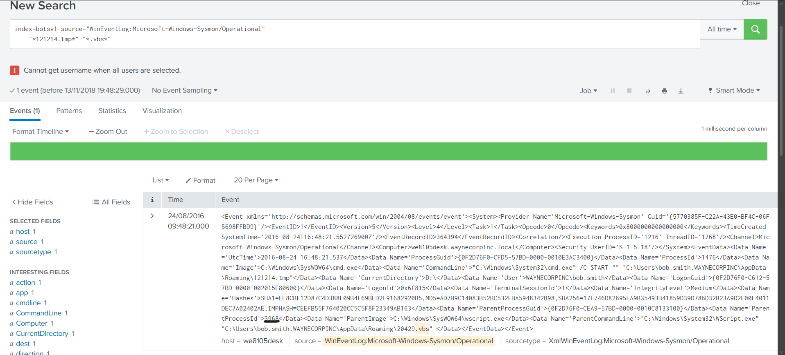
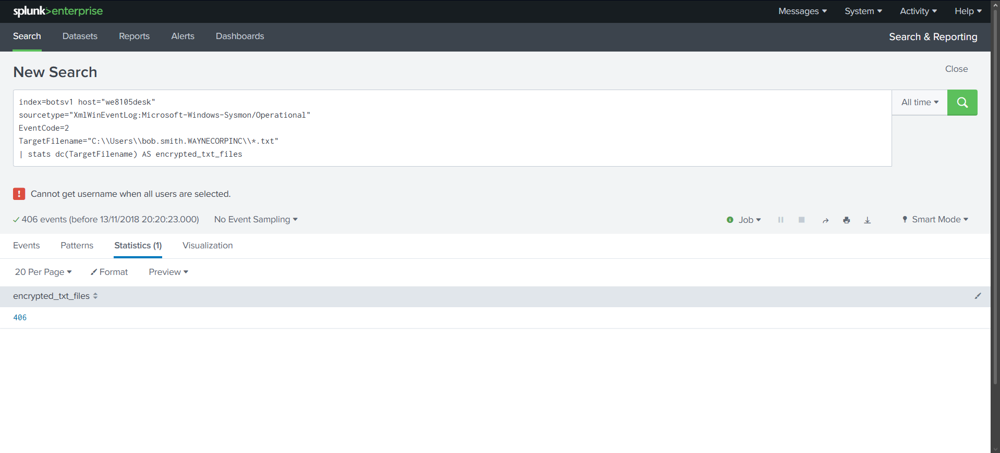
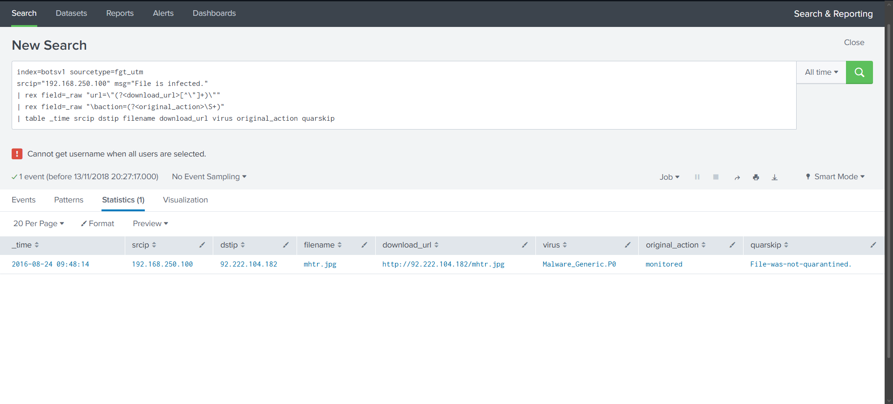

# Scenario 02 — Cerber Ransomware Investigation

**Dataset:** Splunk BOTSv1  
**Host:** `we8105desk`  
**User:** `WAYNECORPINC\bob.smith`

## Quick recall

This one is easiest to remember as:

**`wscript.exe → cmd.exe → 121214.tmp → 406 .txt paths → mhtr.jpg → steganography`**

What I found:
- `wscript.exe` was the parent of `cmd.exe`.
- The parent process ID was `3968`.
- The lab search returned `406` distinct `.txt` paths in Bob Smith's profile.
- A Fortigate event showed the suspicious file `mhtr.jpg` coming from `92.222.104.182`.
- External research on this Cerber campaign links `mhtr.jpg` with steganography.

The important part is not just the answers. I also checked what each log actually proves and where the evidence is incomplete.

---

## 1. Parent process behind the launch

I searched Sysmon for the temporary file together with the VBS activity:

```spl
index=botsv1 source="WinEventLog:Microsoft-Windows-Sysmon/Operational"
"*121214.tmp*" "*.vbs*"
```

The event shows `cmd.exe` being started with `cmd.exe /C START`. Its parent process is `wscript.exe`, which was running the VBS script.

| Field | Value |
|---|---|
| Host | `we8105desk` |
| User | `WAYNECORPINC\bob.smith` |
| Image | `C:\Windows\SysWOW64\cmd.exe` |
| ProcessId | `1476` |
| ParentProcessId | `3968` |
| ParentImage | `C:\Windows\SysWOW64\wscript.exe` |
| Script | `20429.vbs` |

**Result:** `3968`

The main thing I had to watch here was the difference between the child PID and the parent PID. `1476` belongs to `cmd.exe`; `3968` is the parent process ID asked for in the exercise.



## 2. Counting the text-file paths

Next I filtered Sysmon events for `.txt` files under Bob Smith's profile:

```spl
index=botsv1 host="we8105desk"
sourcetype="XmlWinEventLog:Microsoft-Windows-Sysmon/Operational"
EventCode=2
TargetFilename="C:\\Users\\bob.smith.WAYNECORPINC\\*.txt"
| stats dc(TargetFilename) AS txt_files
```

**Result:** `406` distinct paths.

I used `dc(TargetFilename)` because the same path can appear more than once in the logs. Counting events directly could therefore give a misleading number.

One limitation is worth keeping: Sysmon Event ID 2 records a file creation-time change. By itself, it does not prove that every one of those files was encrypted. In the context of the Cerber exercise, `406` is the expected count, but I would want extra file or process evidence before making that claim in a real incident.



## 3. Finding the suspicious download

I then searched the Fortigate UTM logs for infected-file detections from `192.168.250.100`:

```spl
index=botsv1 sourcetype=fgt_utm
srcip="192.168.250.100" msg="File is infected."
| rex field=_raw "url=\"(?<download_url>[^\"]+)\""
| rex field=_raw "\baction=(?<original_action>\S+)"
| table _time srcip dstip filename download_url virus original_action quarskip
```

**Result:** `mhtr.jpg`

The event points to:

`hxxp://92[.]222[.]104[.]182/mhtr.jpg`

The detection name is `Malware_Generic.P0`.

The firewall action is also useful: it shows `monitored`, and `quarskip` indicates the file was not quarantined. So the log proves a detection, but not that the firewall blocked or removed the file.



## 4. Why steganography?

The `.jpg` extension alone is not enough to say steganography.

I checked published analysis of this Cerber campaign. Netskope describes malicious content hidden inside `mhtr.jpg` and references the same delivery infrastructure. That supports **steganography** as the answer for this part of the exercise.

I did not decode the image or analyze a malware sample myself, so I keep this finding separate from the things directly visible in my Splunk logs.

## 5. Short timeline

The Fortigate event appears at `09:48:14`, and the process event at `09:48:21` in the Splunk display — about seven seconds apart if both searches use the same timezone.

The raw Sysmon event contains a UTC timestamp, so I would not label the displayed Splunk times as UTC without first checking the timezone configuration.

## 6. Verdict

The evidence is consistent with the Cerber ransomware infection chain used in the BOTSv1 exercise:

`VBS execution → cmd.exe launch → suspicious temporary executable → file activity → suspicious download`

The logs and exercise context strongly support malicious activity. Some parts, such as the exact encryption impact and the steganography finding, need either additional host evidence or external research rather than being proven by a single event.

## 7. MITRE ATT&CK

| Technique | ID | Why it fits |
|---|---|---|
| Visual Basic | T1059.005 | `wscript.exe` running a `.vbs` script |
| Windows Command Shell | T1059.003 | `cmd.exe /C START` |
| Ingress Tool Transfer | T1105 | Suspicious file download |
| Steganography | T1027.003 | Supported by campaign research |
| Data Encrypted for Impact | T1486 | Fits the ransomware scenario, but not proven by Event ID 2 alone |

## 8. What I would check in a real incident

I would isolate the affected endpoint, preserve the relevant logs, and look for the same indicators on other hosts. I would also check why the firewall only monitored the file, verify which files were actually modified or encrypted, review available clean backups, and search for any follow-on activity from the same infrastructure.

## What I would say in an interview

I used Splunk BOTSv1 to follow part of a Cerber ransomware chain. I started with Sysmon to identify the parent process behind a suspicious launch, then counted distinct text-file paths in the affected user's profile, and finally checked Fortigate logs for the suspicious download. The main results were parent PID `3968`, `406` distinct `.txt` paths, and the file `mhtr.jpg`. I also separated direct log evidence from assumptions — for example, Event ID 2 alone does not prove encryption, and the steganography conclusion came from external campaign research.

## Sources

- [Splunk BOTSv1](https://github.com/splunk/botsv1)
- [Netskope — Cerber ransomware and steganography](https://www.netskope.com/blog/anatomy-ransomware-attack-cerber-uses-steganography-hide-plain-sight)
- [Microsoft Sysmon documentation](https://learn.microsoft.com/en-us/sysinternals/downloads/sysmon)

Training exercise only. No malware samples are included in this repository.
